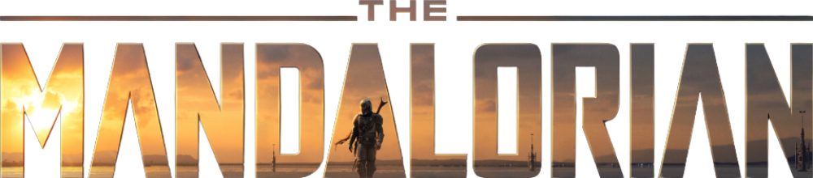
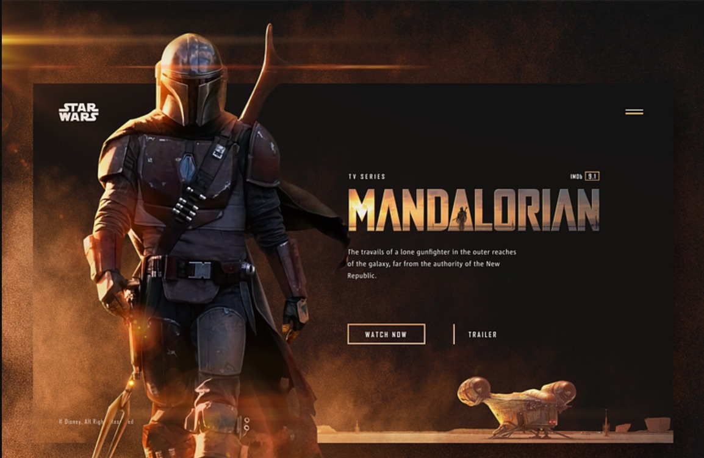

<h1 align="center">Project: The Mandalorian</h1>

<p align="center">
  
</p>

This project involves creating a page dedicated to Disney Plus' renowned series "The Mandalorian". Developed using Next.js and elegantly styled with SASS, the page offers an interactive and informative experience about the saga. Integrating series data through a public API, the project stands out for its modular structure, optimized design and ease of navigation.

<p align="center">
  <a href="#-tecnologias">Technologies</a>&nbsp;&nbsp;&nbsp;|&nbsp;&nbsp;&nbsp;
  <a href="#-projeto">Project</a>&nbsp;&nbsp;&nbsp;|&nbsp;&nbsp;&nbsp;
  <a href="#-layout">Layout</a>&nbsp;&nbsp;&nbsp;|&nbsp;&nbsp;&nbsp;
  <a href="#-license">License</a>
</p>

## 🔗 Links
[](https://instagram.com/davidalmeidadev)
[](https://instagram.com/davidalmeidadev)
[](https://react-project-portfolio.vercel.app/)
[](./LICENSE)

## 🚀 Tecnologies

This project was developed with the following technologies:

- HTML5, CSS3, JS ES6+
- [Node e Yarn](https://nodejs.org/)
- [Next.js](https://nextjs.org/docs)
- [React Lottie](https://www.npmjs.com/package/react-lottie)
- [React Icons](https://www.npmjs.com/package/react-icons)
- [Typescript](https://www.typescriptlang.org/docs/)
- [Axios](https://axios-http.com/ptbr/docs/intro)
- [SASS](https://sass-lang.com/documentation/)

## 💻 Project

In this project, I developed a page dedicated to the series "The Mandalorian" using Next.js and SASS for an efficient and stylized web experience. Next.js provided the ideal foundation, making it easy to create a single-page application with dynamic routing and server-side rendering. With the addition of SASS, we achieve elegant and modular styling, making the code cleaner and easier to maintain.

The integration of a public API enriched the page with dynamic data from the series, allowing users to access up-to-date information about episodes, characters and related details. Every technological and design choice has been carefully considered to provide an immersive experience for Mandalorian fans, while also serving as a practical example of good web development practices.

## 🏡 Get started

Installing project dependencies

```sh
yarn install
```

Application initialization

```sh
yarn dev
```

Application build

```sh
yarn build
```

## 🔖 Layout

You can view the project layout by clicking [here](https://dribbble.com/shots/8359316-The-Mandalorian?utm_source=pinterest&utm_campaign=pinterest_shot&utm_content=The+Mandalorian&utm_medium=Social_Share).

<p align="center">
  
</p>

## 📝 License

This project is under the [MIT license](./LICENSE).
